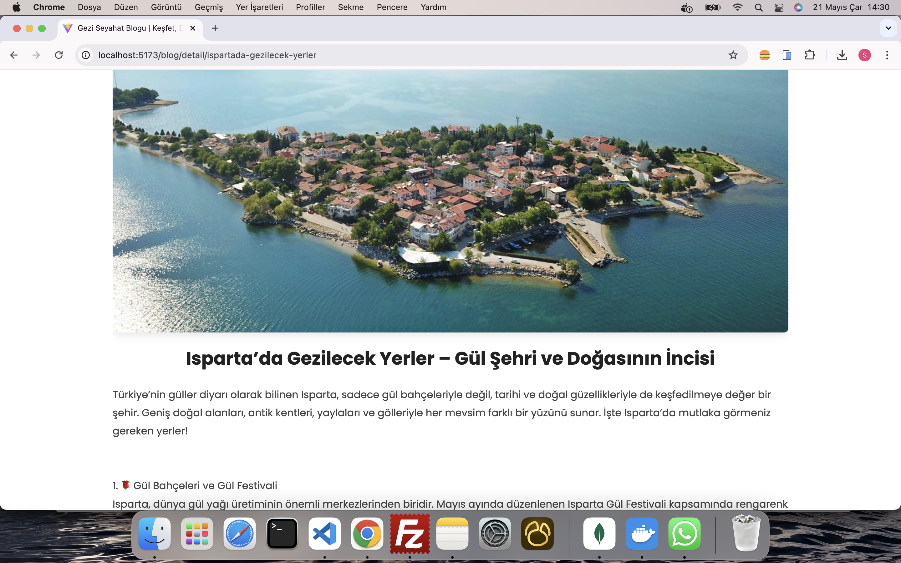
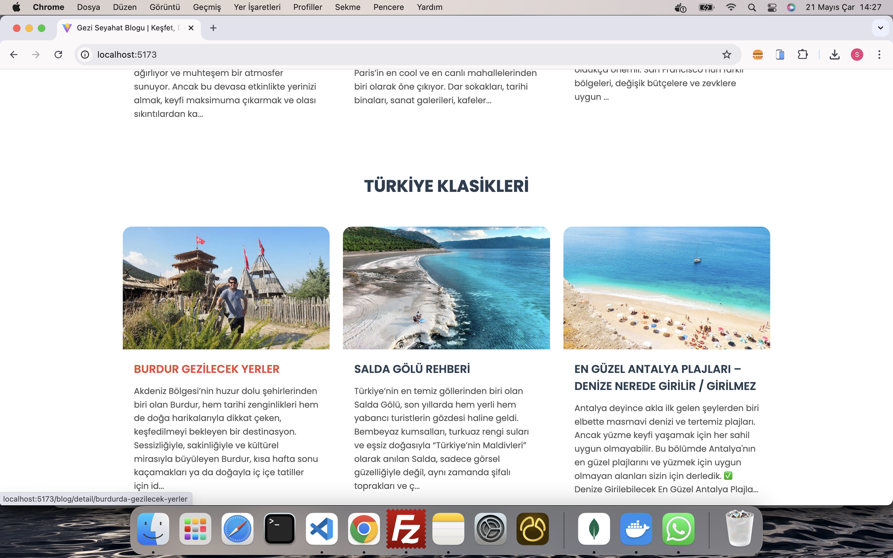

# MERN Blog App

## Proje Hakkında

**MERN Blog App**, MongoDB, Express.js, React.js ve Node.js teknolojilerini kullanarak geliştirilmiş tam özellikli bir blog platformudur. Kullanıcılar yazı paylaşabilir, mevcut yazıları düzenleyebilir, kategorilere göre filtreleme yapabilir ve hesap bilgilerini yönetebilir.

## Özellikler

- **Profesyonel Kullanıcı Yönetimi:**
  - Kullanıcı kayıt ve giriş (Register / Login) işlemleri güvenli bir şekilde JWT ile sağlanır.
  - Hesap bilgilerini güncelleme imkanı.
- **Blog Yönetimi:**
  - Anasayfa üzerinde tüm blog yazılarının listelenmesi.
  - Kategori bazında blog filtreleme.
  - Blog detay sayfası ile yazı içeriğini tam görüntüleme.
- **Statik Sayfalar:**
  - Hakkımızda (Biz Kimiz)
  - İletişim
  - Gizlilik Politikası
  - Kullanım Şartları

---

## Teknolojiler

- **Frontend:** React.js, Redux-Toolkit
- **Backend:** Node.js, Express.js
- **Database:** MongoDB, Mongoose
- **Kimlik Doğrulama:** JWT (JSON Web Token)
- **Stil:** CSS / SCSS / Styled Components (kullandıysan belirt)

---

## Kurulum ve Çalıştırma

1. Depoyu klonlayın:

   ```bash
   git clone https://github.com/kullaniciadi/mern-blog-app.git
   cd mern-blog-app
   ```

cd backend
npm install
npm run dev

cd ../frontend
npm install
npm start

Tarayıcıda http://localhost:5173 adresini açın.

## Ekran Görüntüleri






